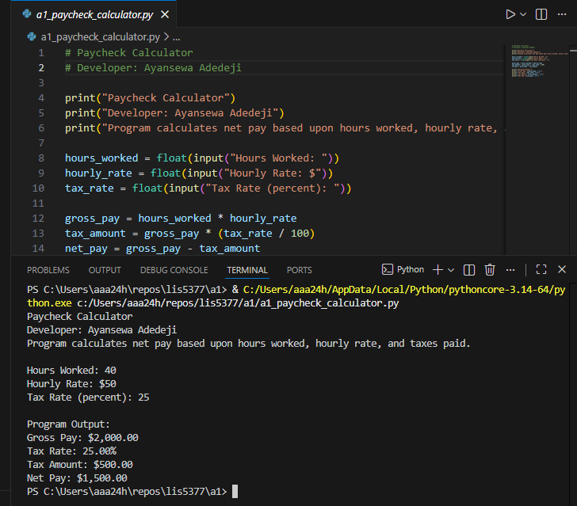
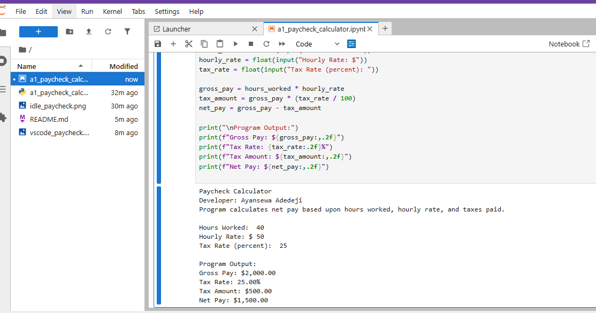
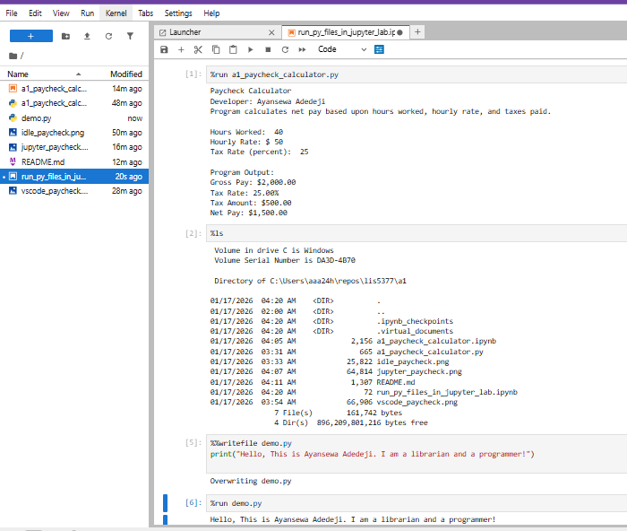
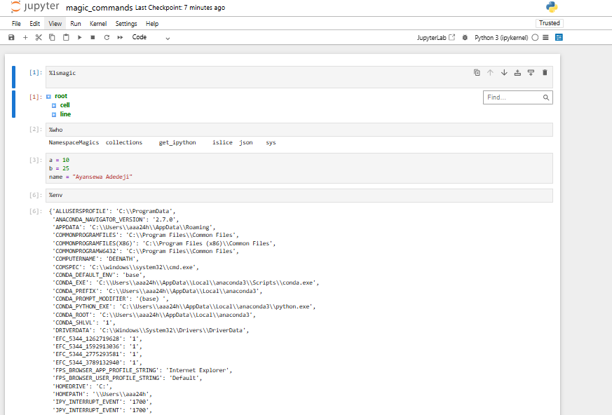

> **NOTE:** This bitbucket was created to showcase lesson learnt in class and projects executed
>

# AI Application (LIS5377)

## Developer: Ayansewa Adedeji

### Assignment 1 Requirements:

1. Distributed Version Control with Git and Bitbucket
2. Development Installations
    - Anaconda Python
    - Visual Studio Code
    - Create a1_paycheck_calculator application
    - Create a1_paycheck_calculator Jupyter Notebook
    - Screenshots of installations
    - Create Bitbucket repo
    - git command descriptions
4. Bitbucket repo link: https://bitbucket.org/librarianandprogrammer/lis5377/src/master/
   

#### The README.md file include the following items:

* Screenshots of a1_paycheck calculator application running (for IDLE)
* Screenshots of a1_paycheck calculator application running (for VScode)
* Screenshots of a1_paycheck calculator application running (for Jupyterlap)
* Screenshots of a1_paycheck calculator application running (for run_py_files_in_jupyter_lab.ipynb
 * Screenshots of a1_paycheck calculator application running (for magic commands)

> 
> 
> 
>
> #### The are some of the Git commands used with short descriptions:

1. git init -- Initializes a new Git repository in the current directory.
2. git status -- Displays the current state of the working directory and staging area.
3. git add -- Stages files so they are included in the next commit.
4. git commit -- Saves staged changes to the local repository with a descriptive message.
5. git remote -v -- Displays the remote repository URLs.
6. git rm -- Removes files from the working directory and staging area.
7. git push -- Uploads local commits to the remote repository.
 

#### Screenshots:

## Screenshot Paycheck Calculator (IDLE)

## Screenshot Paycheck Calculator (Visual Studio Code)

## Screenshot Paycheck Calculator (Jupyter Lab)

## Screenshot: run_py_files_in_jupyter_lab.ipynb

## Screenshot: magic_commands.ipynb

