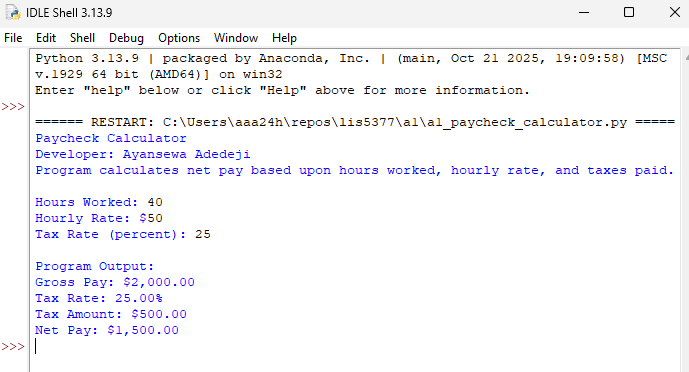

> **NOTE:** This README.md file should be placed at the **root of each subdirectory--e.g., a1, a2, etc.**
>
>Also, this file **must** use Markdown syntax, and provide project documentation as per below--otherwise, points **will** be deducted.
>

# AI Application (LIS5377)

## Ayansewa Adedeji

### Assignment 1 Requirements:

*Four Parts:*

1. Distributed Version Control with Git and Bitbucket
2. Development Installations
3. Questions
4. Bitbucket repo links:
    a) this assignment and
    b) the completed tutorial (bitbucketstationslocations)

#### README.md file should include the following items:

* Screenshots of a1_paycheck calculator application running
* 
* 
* 

> This is a blockquote.
> 
> This is the second paragraph in the blockquote.
>
> #### Git commands w/short descriptions:

1. 
2. 
3. 
4. 
5. 
6. 
7. 

#### Assignment Screenshots (Note: **BE SURE** to modify for specific course!):

## Screenshot Paycheck Calculator (IDLE)

*Screenshot of running java Hello*:

*Screenshot of Android Studio - My First App*:

