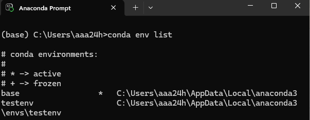
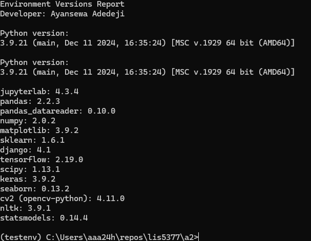
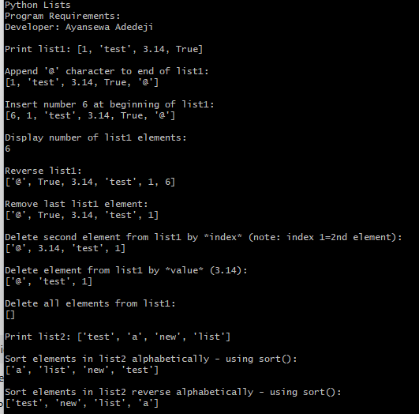
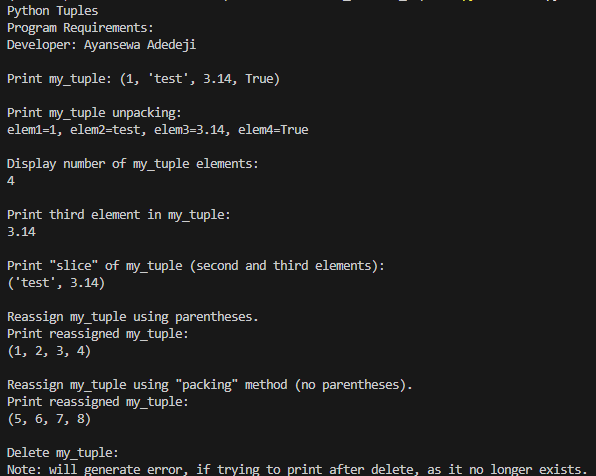
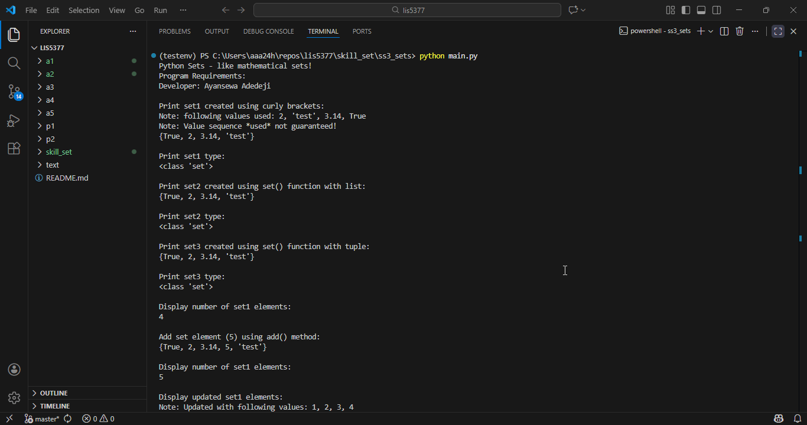

# LIS5377 AI Applications

## Developer: Ayansewa Adedeji

### LIS5377 Requirements (Assignment 2):

*Course Work Links:*

1. [A1 README.md](a1/README.md "My A1 README.md file")
    - Install Anaconda Python
    - Install Visual Studio Code
    - Create a1_paycheck_calculator application
    - Create a1_paycheck_calculator Jupyter Notebook
    - Provide screenshots of installations
    - Create Bitbucket repo
    - Provide git command descriptions
     
2. [A2 README.md](a2/README.md "My A2 README.md file")
    - Create conda environments
    - Using "Separation of Concerns" design principles
    - Examining, sorting, shaping, and analyzing data sets
    - Provide screenshots of completed app
    - Provide screenshots of completed Python skill sets

## Screenshot of Conda environment

## Screenshot of completed app

## Screenshot (Gifs) of A2.ipynb

## Screenshots of running programs based on Skillsets1-3
---

## Skill Set Demonstrations

### SkillSet 1 – Lists
Screenshot of running program demonstrating Python Lists (two-file design: functions.py + main.py).

---

### SkillSet 2 – Tuples
Screenshot of running program demonstrating Python Tuples (two-file design: functions.py + main.py).

---

### SkillSet 3 – Sets
GIF of running program demonstrating Python Sets (two-file design: functions.py + main.py).

3. [A3 README.md](a3/README.md "My A3 README.md file")
    - TBD

4. [A4 README.md](a4/README.md "My A4 README.md file")
    - TBD

5. [A5 README.md](a5/README.md "My A5 README.md file")
    - TBD

6. [P1 README.md](p1/README.md "My P1 README.md file")
    - TBD

7. [P2 README.md](p2/README.md "My P2 README.md file")
    - TBD

