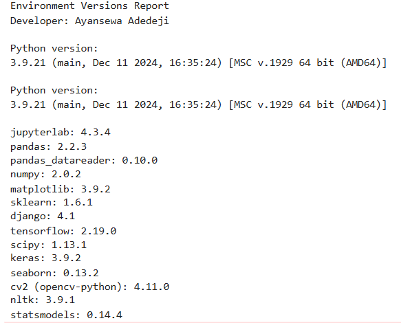
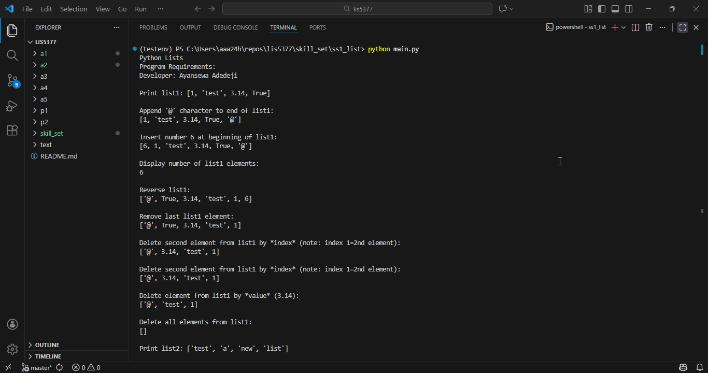
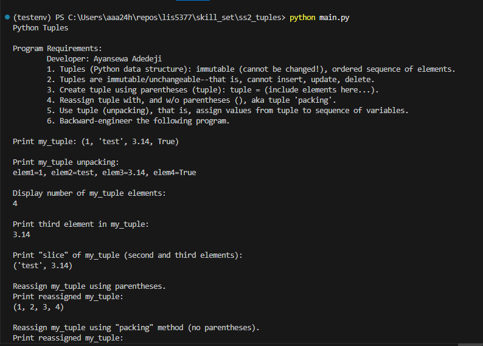

# LIS5377 AI Applications

## Developer: Ayansewa Adedeji

### LIS5377 Requirements (Assignment 2)

1. Requirements
    - Create conda environments
    - Using "Separation of Concerns" design principles
    - Examining, sorting, shaping, and analyzing data sets
    - Provide screenshots of completed app
    - Provide screenshots of completed Python skill sets

## Files
- [A2.ipynb](A2.ipynb)
- [configuration](testenv.yml)

## Screenshot of Conda environment

### Package Versions (JupyterLab)

## Screenshot (Gifs) of A2.ipynb

## Screenshots of running programs based on Skillsets1-3
---

## Skill Set Demonstrations

GIF of running program demonstrating Python Lists (two-file design: functions.py + main.py).

- **[SkillSet 1 – Lists](../skill_set/ss1_list/)**

---

Screenshot of running program demonstrating Python Tuples (two-file design: functions.py + main.py).

- **[SkillSet 2 – Tuples](../skill_set/ss2_tuples/)**

---

GIF of running program demonstrating Python Sets (two-file design: functions.py + main.py).

- **[SkillSet 3 – Sets](../skill_set/ss3_sets/)**

