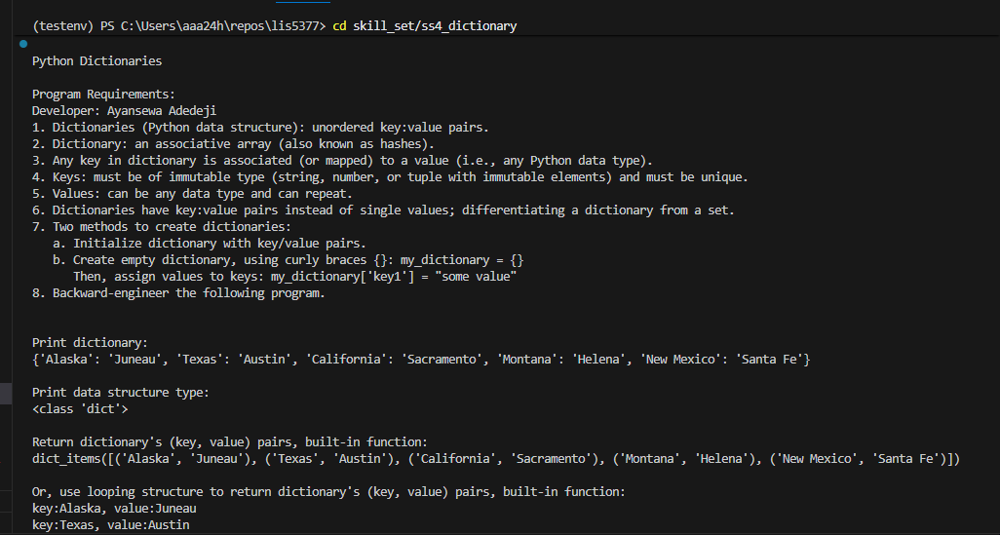
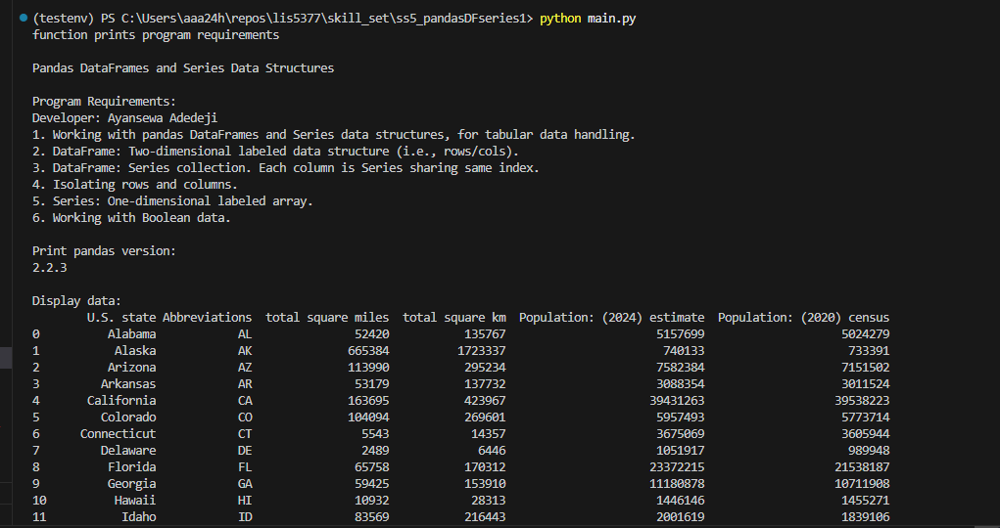
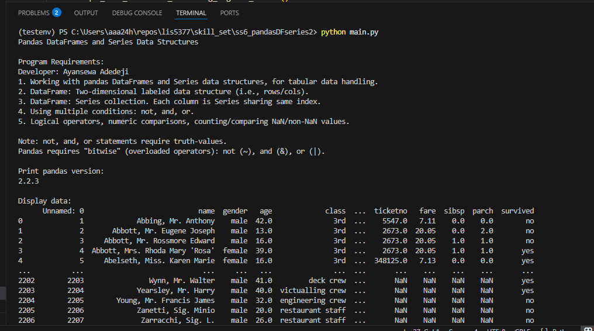

# LIS5377 AI Applications

## Developer: Ayansewa Adedeji

### LIS5377 Requirements (Assignment 3)

1. Requirements
    - Use "Separation of Concerns" design principles
    - Provide screenshots of completed app
    - Provide screenshots of completed python skill sets
    - Links to each skillset (SS4-6)

## Files
- [A3.ipynb](A3.ipynb)

## Screenshot from JupyterLab output

## SkillSet 4 — Dictionary
- [SkillSet 4 — Dictionary](../skill_set/ss4_dictionary)

## SkillSet 5 — Pandas DataFrame / Series 1
- [SkillSet 5 — Pandas DF/Series 1](../skill_set/ss5_pandasDFseries1)

## SkillSet 6 — Pandas DataFrame / Series 2
- [SkillSet 6 — Pandas DF/Series 2](../skill_set/ss6_pandasDFseries2)

