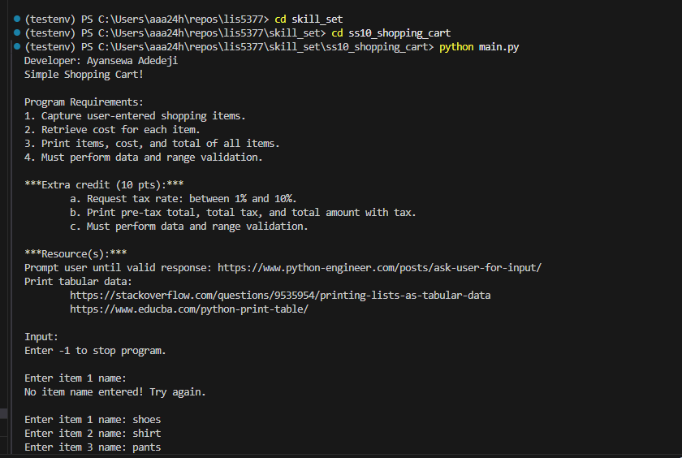
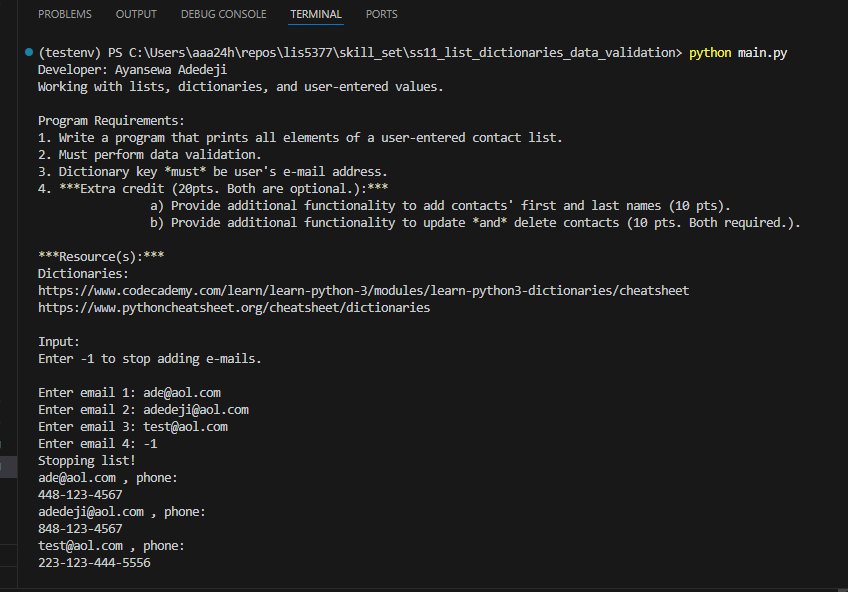
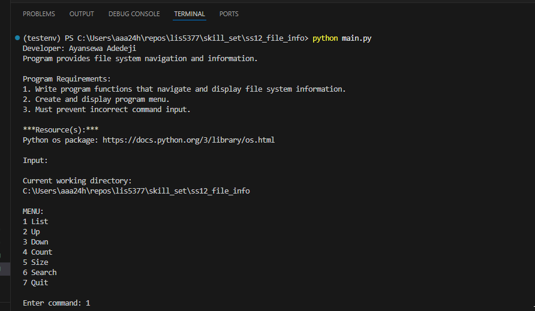

# Assignment 4 – Regression Analysis

## Developer: Ayansewa Adedeji  
### Artificial Intelligence Applications (LIS 5377)

1. Requirements
    - AI vs. Machine-Learning Vs. Deep-learning (similarities/differences)
    - Linear model, regression tests, correlation tests
    - Making predictions using linear regression
    - Plots (residuals and regression line)
    - Provide screenshots of completed python skill sets
    - Links to each skillsets (SS10-12)

## Files
- [a4.ipynb](a4.ipynb)

## Output Screenshots

## Skill Set 10 – Simple Shopping Cart (with data validation)

- [Click to view](../skill_set/ss10_shopping_cart/)

## Skill Set 11 – Lists and dictionaries (with data validation)
- [Click to view](../skill_set/ss11_list_dictionaries_data_validation/)

## Skill Set 12 – File information
- [Click to view](../skill_set/ss12_file_info/)

