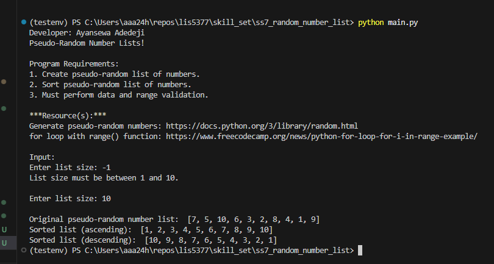
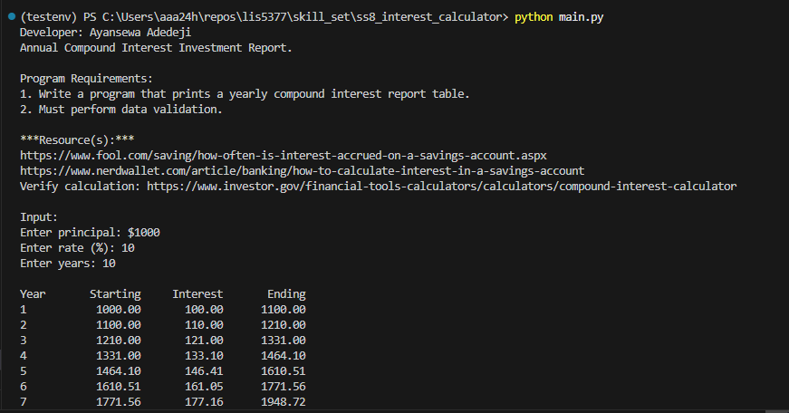
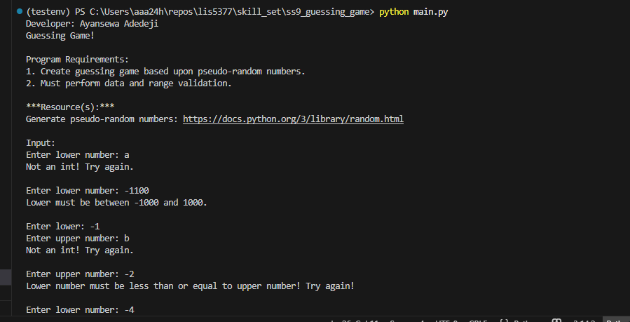

# Project 1 – Text Analysis, Classification, and Prediction

Developer: Ayansewa Adedeji  
Course: Artificial Intelligence Applications (LIS 5377)

## Overview
This project demonstrates natural language processing, sentiment analysis, and predictive classification using Python libraries such as NLTK, pandas, and scikit-learn.

## Steps Performed
1. Import required packages
2. Load review data
3. Tokenize and analyze word frequency
4. Remove stopwords and stem words
5. Perform sentiment analysis using VADER
6. Classify spam vs non-spam emails
7. Evaluate prediction accuracy using confusion matrix

### Requirements

1. Requirements
    - Use "Separation of Concerns" design principles
    - Backward-engineer (using Python)
    - Simple predictive analysis
    - Provide screenshots of completed app
    - Provide screenshots of completed python skill sets (SS7-9)
    - Links to each skillset (SS7-9)

## Files
- [P1.ipynb](p1.ipynb)

## Report on Real-World Application of P1

[Report](real_world_application.doc)

## Output Screenshots

## Skill Set 7 – Pseudo Random Number List

- [Click to view](../skill_set/ss7_random_number_list)

## Skill Set 8 – Annual Compound Interest Investment Report
- [Click to view](../skill_set/ss8_interest_calculator)

## Skill Set 9 – Guessing Game
- [Click to view](../skill_set/ss9_guessing_game)

